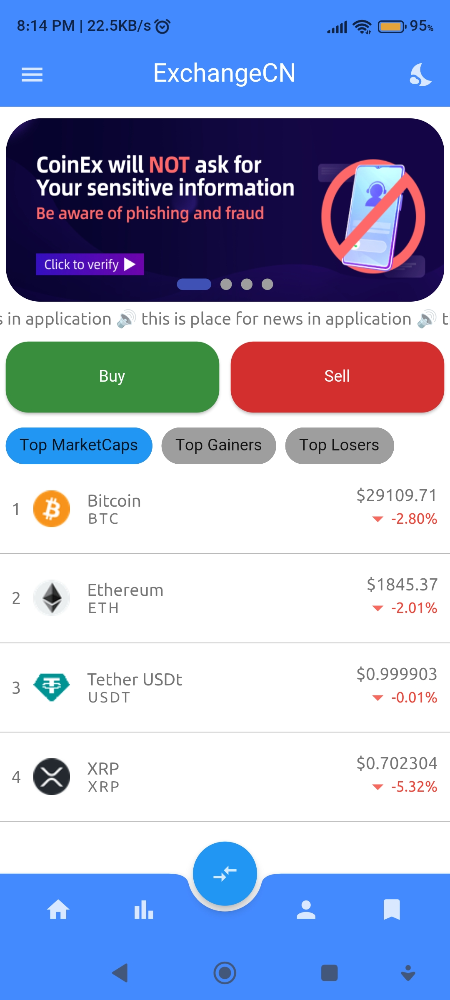
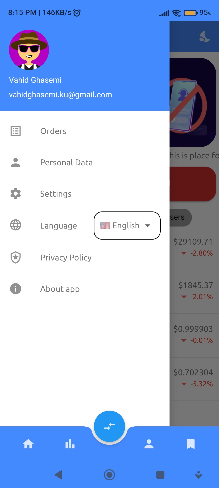
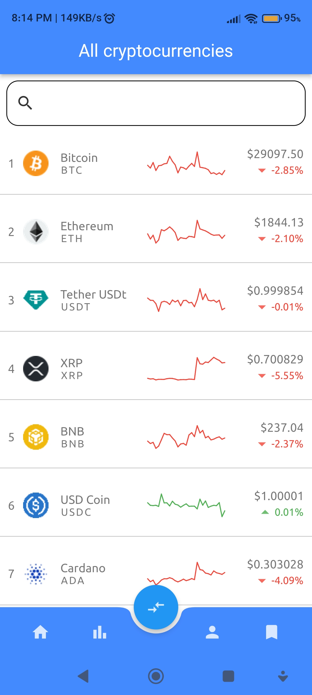
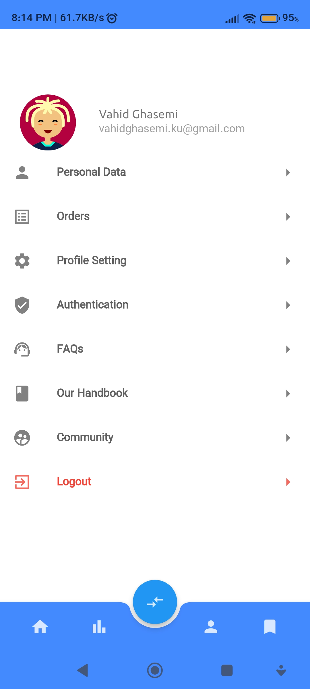
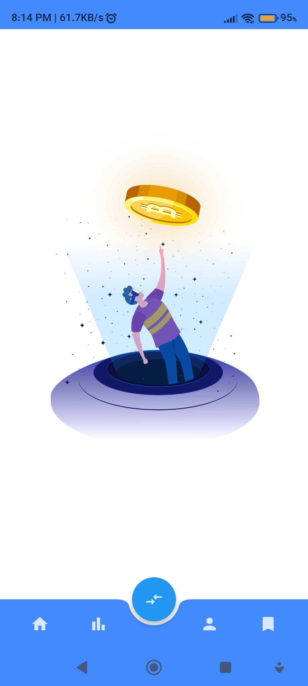
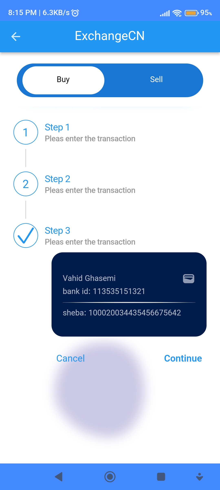
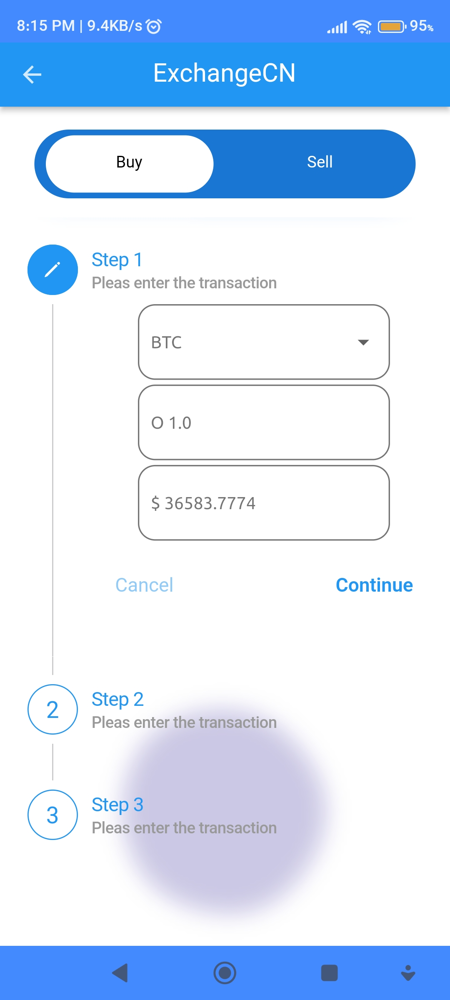
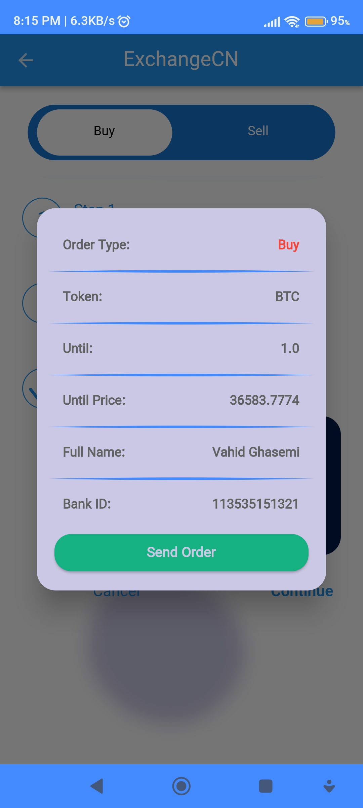
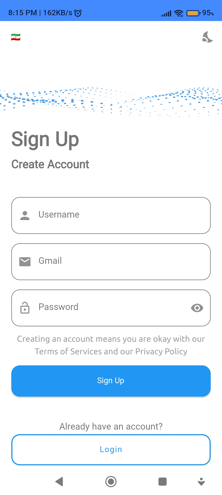

# crypto_nas   

<h2>Download APKs Crypto-Nas</h2>
<a href="https://github.com/vahid6889/Crypto-Nas/blob/master/assets/crypto_nas-armeabi-v7a.apk">crypto_nas-armeabi-v7a.apk</a> 
<a href="https://github.com/vahid6889/Crypto-Nas/blob/master/assets/crypto_nas-arm64-v8a.apk">crypto_nas-arm64-v8a.apk</a> 
<a href="https://github.com/vahid6889/Crypto-Nas/blob/master/assets/crypto_nas-x86_64.apk">crypto_nas-x86_64.apk</a>  

 
How is it weather ?

In this program, you can check the status of your cryptocurrencies graphically and in percentage form, and find out about their winning and losing conditions.

  
  
  
  
  
  
  
  
  

Features of the cryptocurrencies Flutter project:
- Clean Architecture
- Bloc statement
- Featured folder structure
- Responsive view screens
- Testable (coming soon)
- Provided details bloc with Getit
- Lint

The packages used in the project:
- Flutter bloc
- Bloc
- Shared preferences
- Dio
- Flutter localization
- Intl
- Get-it
- Smooth page indicator
- Shimmer effect
- Cached network image
- Flutter SVG
- Email validator
- Lottie
- Teb indicator
- Blobs

## Getting Started

This project is a starting point for a Flutter application.

A few resources to get you started if this is your first Flutter project:

- [Lab: Write your first Flutter app](https://docs.flutter.dev/get-started/codelab)
- [Cookbook: Useful Flutter samples](https://docs.flutter.dev/cookbook)

For help getting started with Flutter development, view the
[online documentation](https://docs.flutter.dev/), which offers tutorials,
samples, guidance on mobile development, and a full API reference.
